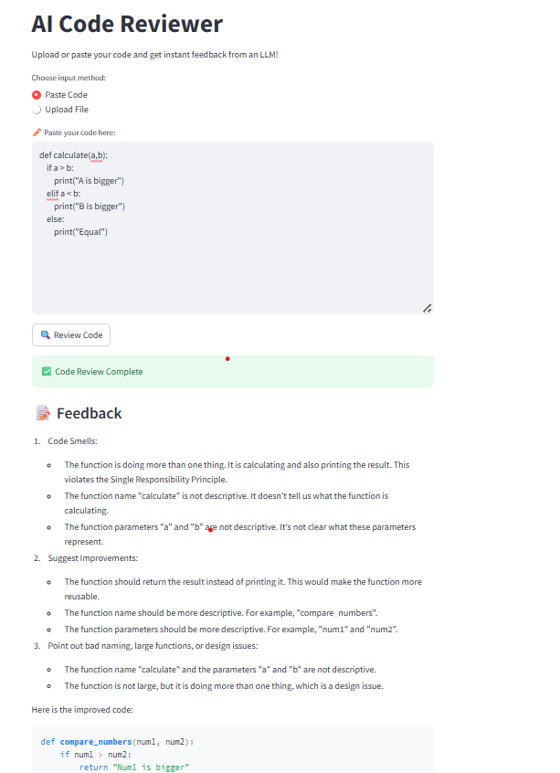

# 🤖 AI Code Reviewer

An AI-powered web app that reviews your Python code using OpenAI's GPT-4. It gives feedback on code quality, design, naming, and more — just paste or upload your code and get instant analysis.



---

## 🚀 Features

- 🧠 Powered by GPT-4 via OpenAI API
- 📝 Detects:
  - Code smells
  - Bad naming patterns
  - Missing docstrings or comments
  - Large functions / design issues
- 📂 Supports both code pasting and `.py` file uploads
- 🌐 Built with Streamlit
- 🔐 Keeps your API key secure using `.env`

---

## ⚙️ Installation

```bash
git clone https://github.com/NaveenKancharla28/AI-code-reviewer.git
cd AI-code-reviewer
python -m venv venv
venv\Scripts\activate       # or source venv/bin/activate
pip install -r requirements.txt
